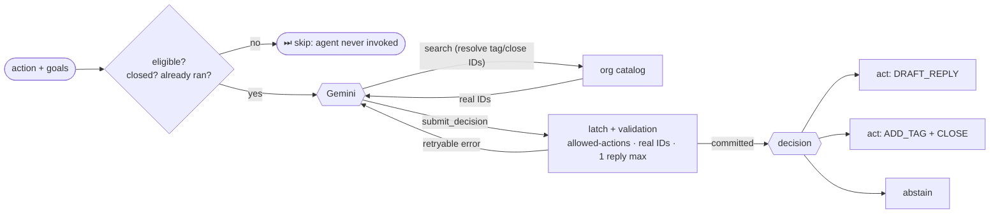
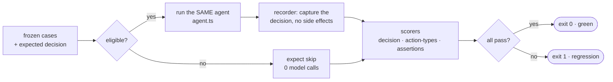
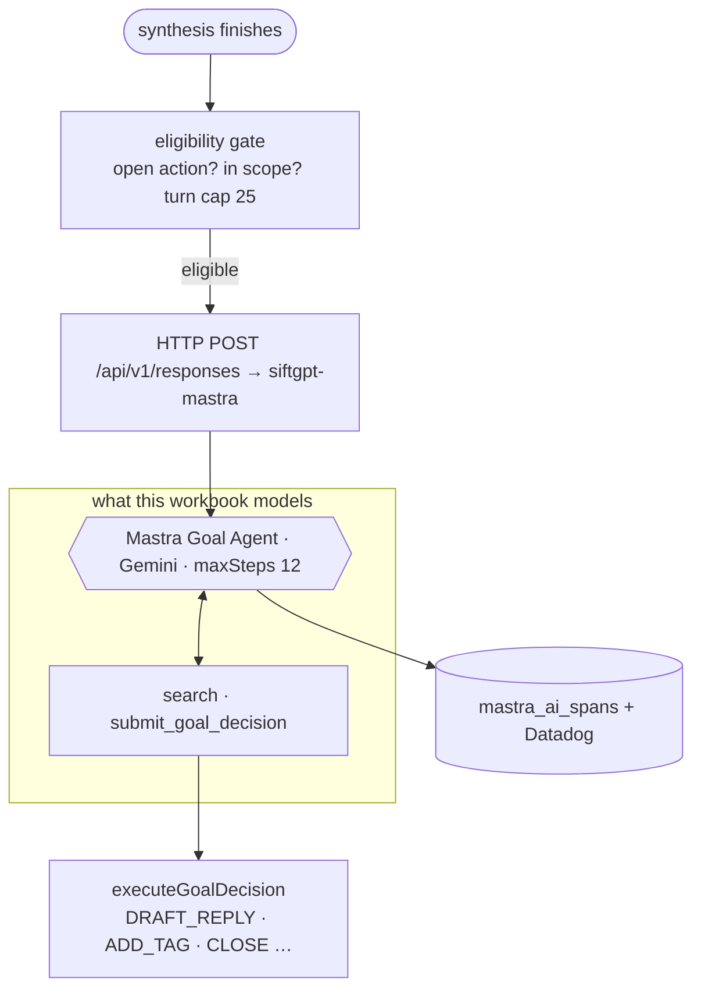

# Goal Agent Workbook

A small, runnable workbook for understanding Sift's autonomous **goal agent** —
the thing that, after synthesis, looks at one customer case and decides whether
to **draft a reply**, **tag/close it**, or **abstain**, based on the goals an org
has configured.

You get the same agent built two ways, plus a frozen bench to test it:

- **[`src/01-vanilla.ts`](src/01-vanilla.ts)** — the agent loop hand-written over the model SDK.
- **[`src/agent.ts`](src/agent.ts)** + **[`src/02-mastra.ts`](src/02-mastra.ts)** — the same agent, run by the [Mastra](https://mastra.ai) framework.
- **[`src/03-bench.ts`](src/03-bench.ts)** — a **frozen bench** that checks the agent still behaves correctly.

All the data — orgs, cases, active cases, and the frozen-bench expectations —
lives in one file, **[`src/data.store.ts`](src/data.store.ts)**; every other file
imports from it. Everything runs on **Google Gemini** (`@ai-sdk/google`) — the
same provider real Sift uses — and shares one decision schema, one set of tools,
and one prompt. Only orchestration differs.

> Simplified **analog** grounded in the real repo (action-type enum, decision
> schema, goal config, the frozen-bench harness). Cases are **synthetic** — no
> customer data. Callouts marked **"real Sift"** point at production files.

---

## Two orgs

A goal agent does whatever the org's **enabled goals** tell it to:

| Org | Goals | What it does |
| --- | --- | --- |
| **Lyft** (mirrors the redacted eval fixtures) | deflect-to-DM + charge-intake (draft) + tag-close (auto) | drafts a DM deflect / no-refund intake for complaints, tags & closes noise, abstains when nothing matches |
| **Newco** | **none configured** | nothing — every case is skipped with `no_enabled_goals` |

Same agent, different config → different behavior. Lyft carries both archetypes
(draft *and* tag/close); Newco has no goals, so the agent is never invoked there.



The run's real output is the **committed decision** — a side effect of the
terminal tool — not the model's final sentence.

### The eligibility gate (skip before invoking)

Before the model is ever called, a gate decides whether the agent should run at
all — mirroring Sift's trigger (`evaluateGoalAgentEligibility` in
[`src/eligibility.ts`](src/eligibility.ts)). A skipped case costs **zero** model
calls. We implement 7 of the real skip reasons:

| reason | fires when | demo case |
| --- | --- | --- |
| `action_not_found` | the action/org doesn't exist | (defensive) |
| `action_closed` | status is terminal (CLOSED) | `X1` |
| `hidden_moderated` | hidden by moderation | `X4` |
| `internal_org` | org is internal/demo | (flag on `Org`) |
| `no_enabled_goals` | org has no goals | `N1` (Newco) |
| `already_ran_for_action` | agent already decided here (once-per-action) | `X2` |
| `turn_cap_reached` | `priorRunCount ≥ 25` (runaway backstop) | `X3` |

The 8th real reason, `no_matching_goals`, needs saved-search **scope** resolution
that this workbook deliberately omits — it's in the type union, not implemented.

```bash
pnpm mastra X1     # CLOSED action        → ⏭ skipped (action_closed)
pnpm mastra N1     # org has no goals     → ⏭ skipped (no_enabled_goals)
pnpm vanilla X3    # 25th re-fire         → ⏭ skipped (turn_cap_reached)
```

---

## Run it

```bash
cd ~/goal-agent-workbook
pnpm install
# put your key in .env (already created, gitignored):
#   GEMINI_API_KEY=your-key      ← https://aistudio.google.com/apikey
```

**Cases:** `L1 L2 L3` (Lyft) · `N1` (Newco, no goals) · `X1–X4` (skip demos).

```bash
pnpm mastra L1      # Lyft: public charge complaint → intake draft, NO refund promise
pnpm mastra L2      # Lyft: stock spam             → tags Irrelevant + closes
pnpm mastra L3      # Lyft: how-to question        → abstains (no matching goal)
pnpm mastra N1      # Newco: no goals configured   → ⏭ skipped (no_enabled_goals)
pnpm vanilla X1     # Lyft: CLOSED action          → ⏭ skipped (action_closed)
```

`pnpm vanilla <case>` and `pnpm mastra <case>` run the same case two ways.

---

## The frozen bench

Answers **"is the goal agent still working correctly?"** — a checked-in set of
`{frozen case → expected decision}` records, run against the real agent, scored.

```bash
pnpm bench
```



Each of the 8 cases pins an expected `decision` (`act` / `abstain` / `skipped`)
+ set of **action types** + safety **assertions** (`english-reply`,
`no-fabricated-ids`, `no-refund-promise`). The 5 skip cases assert the gate fires
and the model is never called (so the bench only makes 3 model calls). The runner
exits nonzero if any case fails, so it works as a regression gate. The model is
non-deterministic, so treat a *consistent* failure as a real regression.

**This mirrors Sift's real frozen bench 1:1:** it runs the *production* agent and
swaps only `submit_goal_decision`'s executor for a **recorder** that captures the
decision instead of drafting/tagging. Our decision sink already only records — so
the demo and the bench run the identical agent. (Real Sift also freezes redacted
snapshots of real prod actions with a sha256 manifest, and adds LLM-judge scorers
that grade reply *wording* against a held-out human reply — we keep it structural
and runnable.)

---

## Vanilla vs Mastra — who does each job

| Job | Vanilla (`01`) — you write it | Mastra (`agent.ts`) — declared |
| --- | --- | --- |
| Tool definitions | `tool({ parameters: <zod> })`, no `execute` | `createTool({ inputSchema, execute })` |
| The agent loop | a hand-written `for` loop over `generateText` | `agent.generate(...)` |
| Tool dispatch | `runTool()` switch | Mastra routes to each tool's `execute` |
| History threading | `messages.push(...)` | internal to `generate` |
| Step cap | `MAX_STEPS = 12` | `{ maxSteps: 12 }` |
| Retry on bad input | tool result with `isError: true` | `execute` returns `{ ok:false, retryable:true }` |

Mastra owns the *orchestration*; you still own the *judgment* — schema, tool
logic, prompt (shared, in `schema.ts` / `tools.ts` / `prompt.ts`).

---

## How it maps to real Sift



| Real Sift piece | File |
| --- | --- |
| Eligibility gate (`evaluateGoalAgentEligibility`, skip reasons) | `packages/core/action-manager/src/workflow/semantic-goal-agent-trigger.ts` |
| Action-type enum (`GOAL_ALLOWED_ACTION_TYPES`) | `packages/data/timescale-db/src/types/workflow-action-registry.ts` |
| Goal config model (`WorkflowGoal`) | `packages/data/timescale-db/src/models/workflow-goal.ts` |
| Decision schema + terminal tool | `packages/core/agents/src/agents/tools/submit-goal-decision.ts` |
| Decision executor (drafts/tags/closes) | `packages/core/action-manager/src/workflow/execute-goal-decision.ts` |
| The 4 ACTION-CONTEXT blocks | `packages/core/action-manager/src/workflow/get-action-context.ts` |
| **The frozen bench** | `apps/siftgpt-mastra/src/evals/goal-agent/bench/` |
| Per-org goal defs (draft vs tag) | `apps/siftgpt-mastra/src/evals/goal-agent/suites/replay/definitions.ts` |

---

## Files

| File | What it is |
| --- | --- |
| [`src/data.store.ts`](src/data.store.ts) | **all data**: orgs, cases, active cases, and frozen-bench expectations |
| [`src/eligibility.ts`](src/eligibility.ts) | the pre-invocation skip gate (`action_closed`, `already_ran_for_action`) |
| [`src/model.ts`](src/model.ts) | the shared Gemini model + key resolution (mirrors Sift) |
| [`src/schema.ts`](src/schema.ts) | the one decision schema (Sift's `submitGoalDecisionSchema` shape) |
| [`src/tools.ts`](src/tools.ts) | `search` + the decision sink (latch, validation, records-not-executes) |
| [`src/prompt.ts`](src/prompt.ts) | system prompt + the 4 ACTION-CONTEXT blocks |
| [`src/agent.ts`](src/agent.ts) | the shared Mastra agent (used by the demo AND the bench) |
| [`src/01-vanilla.ts`](src/01-vanilla.ts) | the agent as a hand-written loop — read first |
| [`src/02-mastra.ts`](src/02-mastra.ts) | run one case on the framework agent |
| [`src/03-bench.ts`](src/03-bench.ts) | the frozen bench: scored runner |

## Exercises

1. **Watch config gate the agent.** Run `N1` (Newco → skipped, no model call),
   then add a goal to Newco in `data.store.ts` and re-run — it now invokes.
2. **Break a bench case.** Edit Lyft's `goal_charge_intake` instructions to allow
   promising refunds, run `pnpm bench`, and watch `L1` go red on `no-refund-promise`.
3. **Force a retry.** Give a goal `allowedActions: []`, run its case, and watch
   the model read the validation error and correct itself — zero orchestration
   code from you.
4. **Read the real thing.** Open `submit-goal-decision.ts`,
   `semantic-goal-agent-trigger.ts`, and the bench `README.md` with the mapping
   table above beside you.
