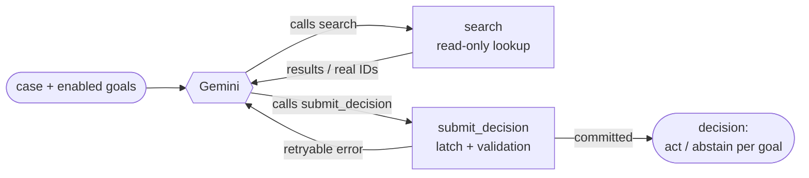
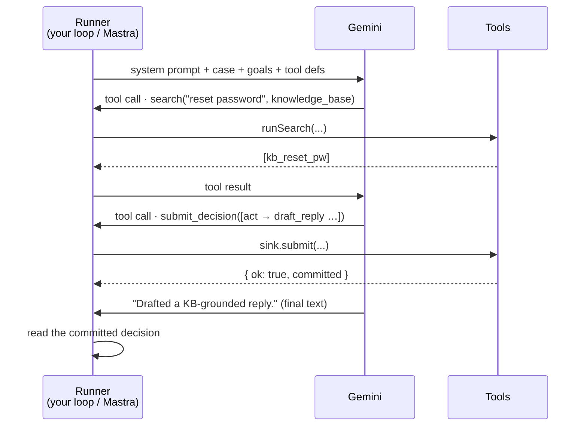
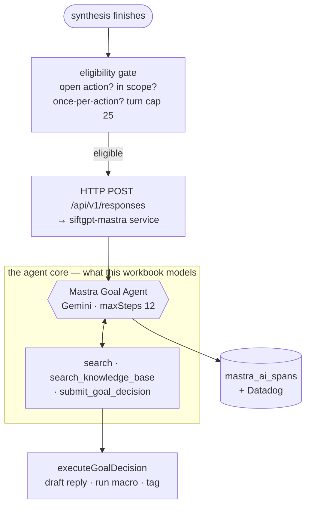

# Goal Agent Workbook

A small, runnable workbook for understanding how a **goal agent** works — the
kind Sift runs autonomously after synthesis. The same agent is built two ways so
you can see what an agent framework actually does for you:

- **[`src/01-vanilla.ts`](src/01-vanilla.ts)** — the agent loop hand-written over the model SDK.
- **[`src/02-mastra.ts`](src/02-mastra.ts)** — the identical behavior, run by the [Mastra](https://mastra.ai) framework.

Both run on **Google Gemini** (via `@ai-sdk/google`) — the same provider the real
Sift goal agent uses — and share one domain, one decision schema, one set of
tools, and one prompt. Only the orchestration differs.

> Simplified **analog** of Sift's goal agent, not the real thing. It captures the
> shape; callouts marked **"In real Sift"** point at where production differs.

---

## What a goal agent does

It's handed **one case** (a customer message) plus a list of **enabled goals**,
and must decide — for each goal independently — whether to **act** or **abstain**,
using a read-only `search` tool to resolve real IDs and a terminal
`submit_decision` tool to finish.



The run's real output is the **committed decision** — a side effect of the
terminal tool — not the model's final sentence.

## One run, end to end



The loop repeats until the model stops calling tools or hits the step cap (12).

---

## Vanilla vs Mastra — who does each job

| Job | Vanilla (`01`) — you write it | Mastra (`02`) — declared |
| --- | --- | --- |
| Tool definitions | `tool({ parameters: <zod> })`, no `execute` | `createTool({ inputSchema: <zod>, execute })` |
| The agent loop | a hand-written `for` loop over `generateText` | `agent.generate(...)` |
| Tool dispatch | `runTool()` switch | Mastra routes to each tool's `execute` |
| History threading | `messages.push(...)` assistant + `tool` turns | internal to `generate` |
| Step cap | `MAX_STEPS = 12` guard | `{ maxSteps: 12 }` |
| Retry on bad input | tool result with `isError: true` | `execute` returns `{ ok:false, retryable:true }` |
| Provider swap | rewrite the loop for the new SDK | change one `model:` line |

**The lesson:** Mastra owns the *orchestration* (loop, dispatch, history, cap,
retry). It does **not** own the agent's *judgment* — you still author the schema,
the tools' logic, and the prompt. Those live in
[`schema.ts`](src/schema.ts) · [`tools.ts`](src/tools.ts) · [`prompt.ts`](src/prompt.ts),
imported unchanged by both files.

---

## How this maps to the real Sift goal agent

The workbook models the **agent core** (the boxed part). Production wraps it in a
trigger, a remote invocation, tools that actually mutate data, and tracing:



| Real Sift piece | File |
| --- | --- |
| Trigger + eligibility gate | `semantic-goal-agent-trigger.ts` |
| Remote invocation + run-input prompt | `workflow-goal-agent-client.ts` |
| Terminal decision tool that acts | `submit-goal-decision.ts` |
| Agent wiring, Gemini, tracing | `apps/siftgpt-mastra/src/mastra/index.ts` |

---

## Run it end to end

```bash
cd ~/goal-agent-workbook
pnpm install

# Put your key in .env (already created, and gitignored):
#   GEMINI_API_KEY=your-key-here      ← https://aistudio.google.com/apikey
# The scripts load .env automatically via `tsx --env-file-if-exists`.

pnpm vanilla                     # hand-written agent, default `password` case
pnpm mastra                      # Mastra agent, same case
pnpm both                        # run both back to back and compare
```

Pick a different case to see a different path:

| case | what the agent should do |
| --- | --- |
| `password` (default) | recognize a how-to question → `search` the KB → draft a grounded reply |
| `refund` | recognize a billing issue → **abstain** and tag it (never auto-promise a refund) |
| `praise` | recognize positive feedback → draft a short thank-you |

```bash
pnpm vanilla refund
pnpm mastra praise
```

You'll see each step logged: the model narrates, calls `search`, then
`submit_decision`; the committed decision is printed at the end.

---

## Files

| File | What it is |
| --- | --- |
| [`src/domain.ts`](src/domain.ts) | the toy world: cases, goals, KB, tags |
| [`src/model.ts`](src/model.ts) | the shared Gemini model + key resolution (mirrors Sift) |
| [`src/schema.ts`](src/schema.ts) | the one zod decision schema, used by both |
| [`src/tools.ts`](src/tools.ts) | tool backing logic: `search` + the decision sink (latch + validation) |
| [`src/prompt.ts`](src/prompt.ts) | the stable system prompt + the per-run input prompt |
| [`src/01-vanilla.ts`](src/01-vanilla.ts) | the whole agent as a hand-written loop — read first |
| [`src/02-mastra.ts`](src/02-mastra.ts) | the same agent, framework-managed — read second, then diff |

## Exercises

1. **Break the cap.** Set `MAX_STEPS = 1` in `01` and run `password` — the model
   can't both `search` and `submit_decision` in one step, so it never finishes.
   That's why Sift caps at 12.
2. **Force a retry.** In `tools.ts`, give `goal_escalate_billing`
   `allowedActions: []`, run `refund`, and watch the model read the validation
   error and correct itself — with zero orchestration code from you.
3. **Delete the latch.** Remove the `if (committed) …` guard in
   `createDecisionSink` and watch a double `submit_decision` overwrite the first
   decision. That's the bug the latch prevents.
4. **Read the real thing.** Open `submit-goal-decision.ts` and
   `workflow-goal-agent-client.ts` with the mapping table above beside you.
